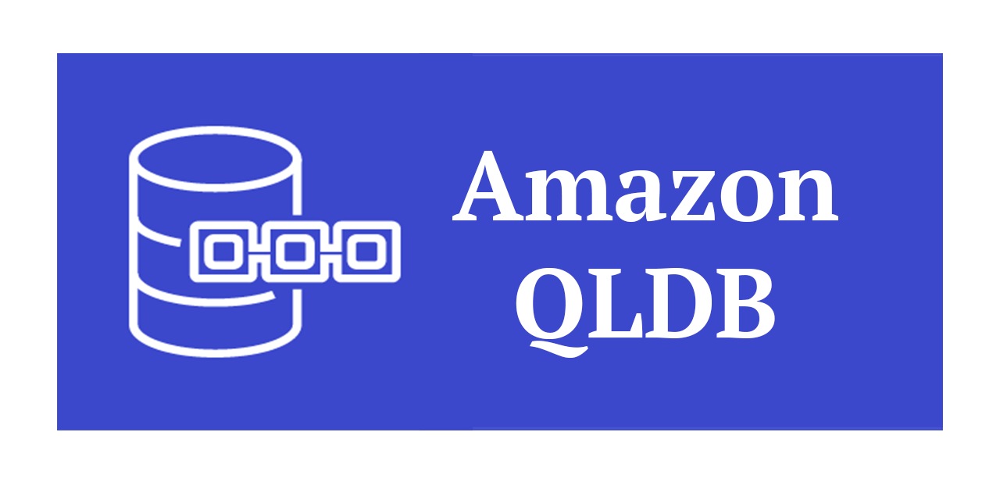

# 

A curated list of guides, development tools, and resources for [Amazon Quantum Ledger Database](https://aws.amazon.com/qldb/) (QLDB). This list includes both community created content as well as content created by AWS.

_Want to add something? Open a PR!_ 🙂

## QLDB Technical Documentation

- [Amazon QLDB documentation](https://docs.aws.amazon.com/qldb/latest/developerguide/getting-started-driver.html)
- [Amazon Ion documentation](http://amzn.github.io/ion-docs/docs.html)
- [Amazon PartiQL documentation](https://partiql.org/docs.html)

## AWS QLDB What's New Announcements

- [QLDB now supports JSON output format for exports](https://aws.amazon.com/about-aws/whats-new/2022/01/amazon-qldb-json-output-format-exports/)
- [QLDB launches new version of QLDB Shell](https://aws.amazon.com/about-aws/whats-new/2021/10/amazon-qldb-new-version-qldb-shell/)
- [QLDB supports customer managed KMS keys](https://aws.amazon.com/about-aws/whats-new/2021/07/amazon-qldb-supports-customer-managed-kms-keys/)
- [QLDB supports IAM-based access](https://aws.amazon.com/about-aws/whats-new/2021/06/amazon-qldb-supports-iam-based-access-policy-for-partiql-queries-and-ledger-tables/)
- [QLDB launches index improvements](https://aws.amazon.com/about-aws/whats-new/2020/09/amazon-qldb-launches-index-improvements/)
- [QLDB supports real time streaming](https://aws.amazon.com/about-aws/whats-new/2020/05/amazon-qldb-supports-real-time-streaming/)

## AWS Customer Blog Articles

- [How Specright uses Amazon QLDB to create a traceable supply chain network](https://aws.amazon.com/blogs/database/how-specright-uses-amazon-qldb-to-create-a-traceable-supply-chain-network/)
- [How fEMR Delivers Cryptographically Secure and Verifiable Medical Data with Amazon QLDB](https://aws.amazon.com/blogs/architecture/how-femr-delivers-cryptographically-secure-and-verifiable-emr-medical-data-with-amazon-qldb/)
- [MediSci’s Platform Leverages Amazon QLDB to Bridge the Gap Between Healthcare and Life Science Product Development](https://aws.amazon.com/blogs/startups/mediscis-platform-leverages-amazon-qldb/)

## AWS QLDB Workshop

- [QLDB Immersion Day Workshop](https://qldb-immersionday.workshop.aws/)

## QLDB GitHub repositories

### Offical AWS QLDB drivers

- [QLDB Java Driver](https://github.com/awslabs/amazon-qldb-driver-java)
- [QLDB Python Driver](https://github.com/awslabs/amazon-qldb-driver-python)
- [QLDB Node Driver](https://github.com/awslabs/amazon-qldb-driver-nodejs)
- [QLDB .Net Driver](https://github.com/awslabs/amazon-qldb-driver-dotnet)
- [QLDB Go Driver](https://github.com/awslabs/amazon-qldb-driver-go)

### Community QLDB Drivers

- [QLDB Rust Driver](https://github.com/Couragium/qldb-rs)
- [Amazon QLDB Key-Value-Store interface driver for NodeJS](https://www.npmjs.com/package/amazon-qldb-kvs-nodejs)

### QLDB Shell

- [QLDB Shell](https://github.com/awslabs/amazon-qldb-shell)

### QLDB Sample Applications

- [A DMV based example application which demonstrates best-practices for using QLDB & the QLDB Driver for Java](https://github.com/aws-samples/amazon-qldb-dmv-sample-java)
- [A DMV based example application which demonstrates best-practices for using QLDB & the QLDB Driver for Python](https://github.com/aws-samples/amazon-qldb-dmv-sample-python)
- [A DMV based example application which demonstrates best-practices for using QLDB & the QLDB Driver for Nodejs](https://github.com/aws-samples/amazon-qldb-dmv-sample-nodejs)
- [Building a GraphQL interface to Amazon QLDB with AWS AppSync](https://github.com/aws-samples/aws-appsync-qldb-data-source)
- [Amazon QLDB Streams integration with Amazon Elasticsearch](https://github.com/aws-samples/amazon-qldb-streaming-amazon-elasticsearch-sample-python)
- [A Basic Sample to demonstrate how to use Amazon QLDB Streams](https://github.com/aws-samples/amazon-qldb-streams-dmv-sample-lambda-python)
- [This sample app is aimed at demonstrating how to model a double entry financial ledger application with QLDB](https://github.com/aws-samples/amazon-qldb-double-entry-sample-java)
- [Implementing Smart Legal Contracts wth Accord Project and Amazon QLDB](https://github.com/accordproject/aws-qldb-lambda)

### Amazon Ion libraries

- [Amazon ION Library](http://amzn.github.io/ion-docs/libs.html)

## AWS Videos

- [AWS re:Invent 2020 - Building out a serverless application with Amazon QLDB](https://www.youtube.com/watch?v=dtBpwCBlz6M)
- [Presentation at AWS re:Invent 2019 with BMW, DVLA, and Sage (47 min)](https://www.youtube.com/watch?v=TMQuN0eqPck)
- [QLDB Senior Principal Engineer Andrew Certain’s Deep Dive (50 min)](https://www.youtube.com/watch?v=ZfYDl4kaVCo)
- [Building applications with QLDB (Online Tech Talk, Nov 2019)](https://www.youtube.com/watch?v=O5a-Amqdt_w)
- [Building system of record applications (Online Tech Talk, July 2019)](https://www.youtube.com/watch?v=XGeCNr8eOiA)
- [A Customer’s Perspective on Building an Event-Triggered System-of-Record Application with Amazon QLDB](https://pages.awscloud.com/A-Customers-Perspective-on-Building-an-Event-Triggered-System-of-Record-Application-with-Amazon-QLDB_2020_0321-BLC_OD.html)
- [QLDB Animated Intro (3 min)](https://www.youtube.com/watch?v=jcZ_rsLJrqk)

## Podcasts

- [Why are customers choosing Amazon QLDB?](https://aws.amazon.com/podcasts/377-why-are-customers-choosing-amazon-qldb/)
- [Talking Kotlin - QLDB at Amazon](https://talkingkotlin.com/qldb/)

### QLDB Blog Articles

- [Building a core banking system with Amazon Quantum Ledger Database](https://aws.amazon.com/blogs/industries/building-a-core-banking-system-with-amazon-quantum-ledger-database/)
- [Real world cryptographic verification with Amazon QLDB](https://aws.amazon.com/blogs/database/real-world-cryptographic-verification-with-amazon-qldb/)
- [Building a GraphQL interface to Amazon QLDB with AWS AppSync: Part 1](https://aws.amazon.com/blogs/database/part-1-building-a-graphql-interface-to-amazon-qldb-with-aws-appsync/)
- [Building a GraphQL interface to Amazon QLDB with AWS AppSync: Part 2](https://aws.amazon.com/blogs/database/part-2-building-a-graphql-interface-to-amazon-qldb-with-aws-appsync/)
- [In Data We Trust: The Why And How Of Amazon QLDB, A Purpose-Built, Immutable And Verifiable Database](https://www.forbes.com/sites/amazonwebservices/2019/12/23/in-data-we-trust-the-why-and-how-of-amazon-qldb-a-purpose-built-immutable-and-verifiable-database/)
- [Streaming data from QLDB to DynamoDB](https://dev.to/aws-heroes/real-time-streaming-for-amazon-qldb-3c3c)
- [Streaming data from QLDB to Elasticsearch](https://dev.to/aws-heroes/streaming-data-from-amazon-qldb-to-elasticsearch-78c)
- [Verify delivery conditions with the Accord Project and Amazon Quantum Ledger Database – Part 1](https://aws.amazon.com/blogs/database/verify-delivery-conditions-with-the-accord-project-and-amazon-quantum-ledger-database-part-1/)
- [Verify delivery conditions with the Accord Project and Amazon Quantum Ledger Database – Part 2](https://aws.amazon.com/blogs/database/verify-delivery-conditions-with-the-accord-project-and-amazon-quantum-ledger-database-part-2/)
- [Use Amazon QLDB as an immutable key-value store with a REST API and JSON](https://aws.amazon.com/blogs/database/use-amazon-qldb-as-an-immutable-key-value-store-with-a-rest-api-and-json/)
- [Monitor Amazon QLDB query access patterns](https://aws.amazon.com/blogs/database/monitor-amazon-qldb-query-access-patterns/)

## Stackoverflow [(link)](https://stackoverflow.com/questions/tagged/amazon-qldb)

- [Computing commit digest](https://stackoverflow.com/questions/57937869/how-to-get-compute-commitdigest-when-committing-a-transaction-in-aws-qldb) - explains the purpose and algorithm behind CommitDigest
- [Pagination in QLDB](https://stackoverflow.com/questions/59502337/pagination-in-qldb) - positions QLDB with reporting and analytics solutions
- [QLDB unique field](https://stackoverflow.com/questions/59408019/qldb-unique-field) - how to enforce uniqueness for an attribute in QLDB
- [Find history of deleted data](https://stackoverflow.com/questions/58899088/find-the-history-of-deleted-data-in-qldb) - information on how to filter on history
- [QLDB performance limits](https://stackoverflow.com/questions/58254582/amazon-qldb-have-any-scaling-performance-limits) - explanation of concepts such as the document-revision model, transactions, optimistic concurrency control and the journal

## Community contributions

- [QLDB Guide](https://qldbguide.com/)
- [Amazon QLDB and the missing command line client](https://gokhanatil.com/2019/09/amazon-qldb-and-the-missing-command-line-client.html)
